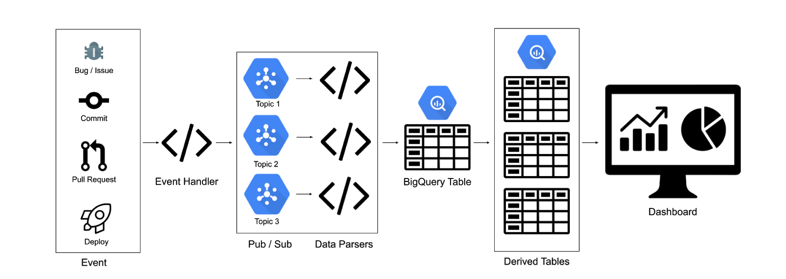
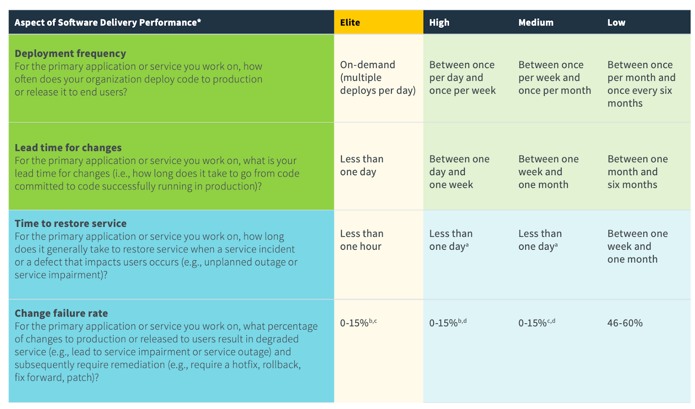

# Four Keys

# Background

Through six years of research, the [DevOps Research and Assessment (DORA)](https://cloud.google.com/blog/products/devops-sre/the-2019-accelerate-state-of-devops-elite-performance-productivity-and-scaling) team has identified four key metrics that indicate the performance of a software development team. Four Keys allows you to collect data from your development environment (such as GitHub or GitLab) and compiles it into a dashboard displaying these key metrics.

These four key metrics are:

*   **Deployment Frequency**
*   **Lead Time for Changes**
*   **Time to Restore Services**
*   **Change Failure Rate**

# Who should use Four Keys

Use Four Keys if:

*   You want to measure your team's software delivery performance. For example, you may want to track the impact of new tooling or more automated test coverage, or you may want a baseline of your team's performance. 
*   You have a project in GitHub or GitLab.
*   Your project has deployments.

Four Keys works well with projects that have deployments. Projects with releases and no deployments, for example, libraries, do not work well because of how GitHub and GitLab present their data about releases.

For a quick baseline of your team's software delivery performance, use can also use the [DORA DevOps Quick Check](https://www.devops-research.com/quickcheck.html). The quick check also suggests DevOps capabilities you can work on to improve your performance. The Four Keys project itself can help you improve the following DevOps capabilities:

*   [Monitoring and observability](https://cloud.google.com/solutions/devops/devops-measurement-monitoring-and-observability)
*   [Monitoring systems to inform business decisions](https://cloud.google.com/solutions/devops/devops-measurement-monitoring-systems)
*   [Visual management capabilities](https://cloud.google.com/solutions/devops/devops-measurement-visual-management)

# How it works

1.  Events are sent to a webhook target hosted on Cloud Run. Events are any occurance in your development environment (for example, GitHub or GitLab) that can be measured, such as a pull request or new issue. Four Keys defines events to measure, and you can add others that are relevant to your project.
1.  The Cloud Run target publishes all events to Pub/Sub.
1.  A Cloud Run instance is subscribed to the Pub/Sub topics, does some light data transformation, and inputs the data into BigQuery.
1.  Nightly scripts are scheduled in BigQuery to complete the data transformations and feed into the dashboard.

This diagram shows the design of the Four Keys system:



# Code structure

* `bq_workers/`
  * Contains the code for the individual BigQuery workers.  Each data source has its own worker service with the logic for parsing the data from the Pub/Sub message. For example, GitHub has its own worker which only looks at events pushed to the GitHub-Hookshot Pub/Sub topic
* `data_generator/`
  * Contains a Python script for generating mock GitHub data.
* `event_handler/`
  * Contains the code for the `event_handler`, which is the public service that accepts incoming webhooks.  
* `queries/`
  * Contains the SQL queries for creating the derived tables.
  * Contains a Python script for schedulig the queries.
* setup/
  * Contains the code for setting up and tearing down the Four Keys pipeline. Also contains a script for extending the data sources.
* `shared/`
  * Contains a shared module for inserting data into BigQuery, which is used by the `bq_workers`

# How to use 

## Out of the box

_The project uses Python 3 and supports data extraction for Cloud Build and GitHub events._

1.  Fork this project.
1.  Run the automation scripts, which does the following (See the [INSTALL.md](setup/INSTALL.md) for more details):
    1.  Set up a new Google Cloud Project.
    1.  Create and deploy the Cloud Run webhook target and ETL workers.
    1.  Create the Pub/Sub topics and subscriptions.
    1.  Enable the Google Secret Manager and create a secret for your GitHub repo.
    1.  Create a BigQuery dataset and tables, and schedule the nightly scripts.
    1.  Open up a browser tab to connect your data to a DataStudio dashboard template.
1.  Set up your development environment to send events to the webhook created in the second step.
    1.  Add the secret to your GitHub webhook.


## Generating mock data

The setup script includes an option to generate mock data. Generate mock data to play with and test the Four Keys project.

The data generator creates mocked GitHub events, which are ingested into the table with the source “githubmock.” It creates following events: 

* 5 mock commits with timestamps no earlier than a week ago
  * _Note: Number can be adjusted_
* 1 associated deployment
* Associated mock incidents 
  * _Note: By default, less than 15% of deployments create a mock incident. This threshold can be adjusted in the script._

To run outside of the setup script:

1. Ensure that you’ve saved your webhook URL and GitHub Secret in your environment variables:

   ```sh
   export WEBHOOK={your event handler URL}
   export GITHUB_SECRET={your github signing secret}
   ```

1. Run the following command:

   ```sh
   python3 data_generator/data.py
   ```

   You can see these events being run through the pipeline:
   *  The event handler logs show successful requests
   *  The Pub/Sub topic show messages posted
   *  The BigQuery GitHub parser show successful requests

1.  You can query the `events_raw` table directly in BigQuery:

    ```sql
    SELECT * FROM four_keys.events_raw WHERE source = 'githubmock';
    ```

## Reclassifying events / updating your queries

The scripts consider some events to be “changes”, “deploys”, and “incidents.” You may want to reclassify one or more of these events, for example, if you want to use a label for your incidents other than “incident.” To reclassify one of the events in the table, no changes are required on the architecture or code of the project.

1.  Update the nightly scripts in BigQuery for the following tables:

    *   `four\_keys.changes`
    *   `four\_keys.deployments`
    *   `four\_keys.incidents`

    To update the scripts, we recommend that you update the `sql` files in the `queries` folder, rather than in the BigQuery UI.

1.  Once you've edited the SQL, run the `schedule.py` script to update the scheduled query that populates the table.  For example, if you wanted to update the `four_keys.changes` table, you'd run:

    ```sh 
    python3 schedule.py --query_file=changes.sql --table=changes
    ```

Notes: 

* The `query_file` flag should contain the relative path of the file.  
* To feed into the dashboard, the table name should be one of `changes`, `deployments`, `incidents`. 


## Extending to other event sources

To add other event sources:

1.  Add to the `AUTHORIZED_SOURCES` in `sources.py`.
    1.  If create a verification function, add the function to the file as well.
1.  Run the `new_source.sh` script in the `setup` directory. This script creates a Pub/Sub topic, a Pub/Sub subscription, and the new service using the `new_source_template` .
    1.  Update the `main.py` in the new service to parse the data properly.
1.  Update the BigQuery script to classify the data properly.

**If you add a common data source, please submit a pull request so that others may benefit from the functionality.**


## Running tests
This project uses nox to manage tests. The `noxfile` defines what tests run on the project. It’s set up to run all the `pytest` files in all the directories, as well as run a linter on all directories. 

To run nox:

1.  Ensure that nox is installed:

    ```sh
    pip install nox
    ```

1.  Use the following command to run nox:

    ```sh
    python3 -m nox
    ```

### Listing tests

To list all the test sesssions in the noxfile, use the following command:

```sh
python3 -m nox -l
```

### Running a specific test

Once you have the list of test sessions, you can run a specific session with:

```sh
python3 -m nox -s "{name_of_session}" 
```

The "name_of_session" will be something like "py-3.6(folder='.....').  

# Data schema

### `four\_keys.events\_raw`

<table>
  <tr>
   <td><strong>Field Name</strong>
   </td>
   <td><strong>Type</strong>
   </td>
   <td><strong>Notes</strong>
   </td>
  </tr>
  <tr>
   <td>source
   </td>
   <td>STRING
   </td>
   <td>eg: github
   </td>
  </tr>
  <tr>
   <td>event_type
   </td>
   <td>STRING
   </td>
   <td>eg: push
   </td>
  </tr>
  <tr>
   <td>🔑id
   </td>
   <td>STRING
   </td>
   <td>Id of the development object. Eg, bug id, commit id, PR id
   </td>
  </tr>
  <tr>
   <td>metadata
   </td>
   <td>JSON
   </td>
   <td>Body of the event
   </td>
  </tr>
  <tr>
   <td>time_created
   </td>
   <td>TIMESTAMP
   </td>
   <td>The time the event was created
   </td>
  </tr>
  <tr>
   <td>signature
   </td>
   <td>STRING
   </td>
   <td>Encrypted signature key from the event. This will be the <strong>unique key</strong> for the table.  
   </td>
  </tr>
  <tr>
   <td>msg_id
   </td>
   <td>STRING
   </td>
   <td>Message id from Pub/Sub
   </td>
  </tr>
</table>

Where the key icon indicates that the ID is generated by the original system, such as GitHub.

This table will be used to create the following three derived tables: 


#### `four\_keys.deployments` 

_Note: Deployments and changes have a many to one relationship.  Table only contains successful deployments._


<table>
  <tr>
   <td><strong>Field Name</strong>
   </td>
   <td><strong>Type</strong>
   </td>
   <td><strong>Notes</strong>
   </td>
  </tr>
  <tr>
   <td>🔑deploy_id
   </td>
   <td>string
   </td>
   <td>Id of the deployment - foreign key to id in events_raw
   </td>
  </tr>
  <tr>
   <td>changes
   </td>
   <td>array of strings
   </td>
   <td>List of id’s associated with the deployment. Eg: commit_id’s, bug_id’s, etc.  
   </td>
  </tr>
  <tr>
   <td>time_created
   </td>
   <td>timestamp
   </td>
   <td>Time the deployment was completed
   </td>
  </tr>
</table>

Where the key icon indicates that the ID is generated by the original system, such as GitHub.

#### `four\_keys.changes`


<table>
  <tr>
   <td><strong>Field Name</strong>
   </td>
   <td><strong>Type</strong>
   </td>
   <td><strong>Notes</strong>
   </td>
  </tr>
  <tr>
   <td>🔑change_id
   </td>
   <td>string
   </td>
   <td>Id of the change - foreign key to id in events_raw
   </td>
  </tr>
  <tr>
   <td>time_created
   </td>
   <td>timestamp
   </td>
   <td>Time_created from events_raw
   </td>
  </tr>
  <tr>
   <td>change_type
   </td>
   <td>string
   </td>
   <td>The event type
   </td>
  </tr>
</table>

Where the key icon indicates that the ID is generated by the original system, such as GitHub.

#### `four\_keys.incidents`


<table>
  <tr>
   <td><strong>Field Name</strong>
   </td>
   <td><strong>Type</strong>
   </td>
   <td><strong>Notes</strong>
   </td>
  </tr>
  <tr>
   <td>🔑incident_id
   </td>
   <td>string
   </td>
   <td>Id of the failure incident
   </td>
  </tr>
  <tr>
   <td>changes
   </td>
   <td>array of strings
   </td>
   <td>List of deployment ID’s that caused the failure
   </td>
  </tr>
  <tr>
   <td>time_created
   </td>
   <td>timestamp
   </td>
   <td>Min timestamp from changes
   </td>
  </tr>
  <tr>
   <td>time_resolved
   </td>
   <td>timestamp
   </td>
   <td>Time the incident was resolved
   </td>
  </tr>
</table>

Where the key icon indicates that the ID is generated by the original system, such as GitHub.

# Dashboard 

The dashboard displays all four metrics with daily systems data, as well as a current snapshot of the last 90 days.  

To understand the metrics and intent of the dashboard, see the [2019 State of DevOps Report](https://services.google.com/fh/files/misc/state-of-devops-2019.pdf). 


## Metrics definitions

**Deployment Frequency**

*   The number of deployments per time period: daily, weekly, monthly, yearly. 

**Lead Time for Changes**

*   The median amount of time for a commit to be deployed into production.

**Time to Restore Services**

*   For a failure, the median amount of time between the deployment which caused the failure and the restoration.  The restoration is measured by closing an associated bug / incident report. 

**Change Failure Rate**

*   The number of failures per the number of deployments. For example, if there are four deployments in a day and one causes a failure, that is a 25% change failure rate.

## Color coding

The color coding of the quarterly snapshots roughly follows the buckets described in the [State of DevOps Report](https://cloud.google.com/devops).  

**Deployment Frequency**

*   **Green:** Weekly
*   **Yellow:** Monthly
*   **Red:** Between once per month and once every 6 months.  
    *   This is expressed as “Yearly.” 

**Lead Time to Change**

*   **Green:** Less than one week
*   **Yellow:** Between one week and one month
*   **Red:** Between one month and 6 months.  
*   **Red:** Anything greater than 6 months
    *   This is expressed as “One year.” 

**Time to Restore Service**

*   **Green:** Less than one day
*   **Yellow:** Less than one week
*   **Red:**  Between one week and a month
    *   This is expressed as “One month” 
*   **Red:** Anything greater than a month
    *   This is expressed as “One year” 

**Change Failure Rate**

*   **Green:** Less than 15%
*   **Yellow:** 16% - 45%
*   **Red:**  Anything greater than 45%

The following chart is from the [State of DevOps Report](https://cloud.google.com/devops), and shows the ranges of each key metric for the different category of performers.



Disclaimer: This is not an officially supported Google product
